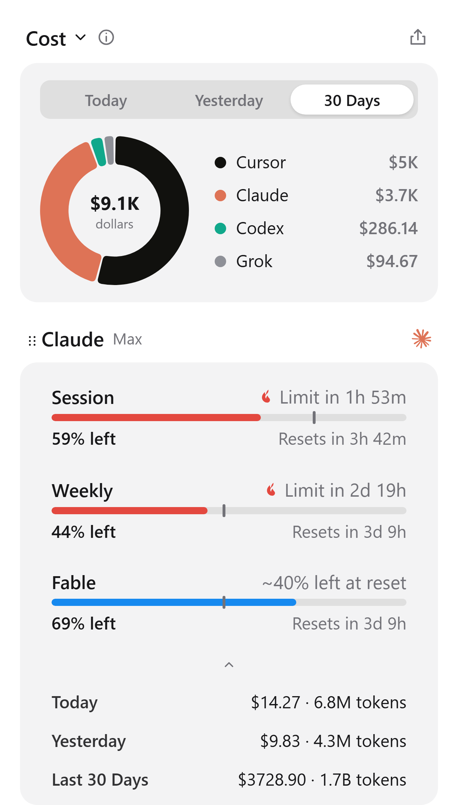

<p align="center">
  
</p>

<h1 align="center">OpenQuota</h1>

<p align="center">
  Keep your AI coding subscriptions in view from the system tray.
</p>

<p align="center">
  <a href="https://github.com/deviffyy/OpenQuota/actions/workflows/ci.yml"></a>
  <a href="https://github.com/deviffyy/OpenQuota/releases/latest"></a>
  <a href="LICENSE"></a>
</p>

OpenQuota shows how much of your AI coding plans you have used without pulling you away from your
work. Session and weekly limits, reset times, local token usage, and estimated spend all live in one
compact panel. Pin the numbers you care about most to the tray or macOS menu bar.

<p align="center">
  
</p>

## Installation

Download the latest build from the [OpenQuota releases
page](https://github.com/deviffyy/OpenQuota/releases/latest):

- **Windows:** x64 and ARM64 NSIS installers
- **macOS:** Universal DMG for Apple Silicon and Intel Macs (macOS 11 or later)
- **Linux:** x64 and ARM64 AppImage and Debian packages

OpenQuota automatically checks for updates, and every installable update is cryptographically
signed. Windows, macOS, and Linux AppImage builds can update from inside the app. Debian users can
download and install the latest package from the releases page.

## Supported providers

- **Claude Code** — session, weekly, Sonnet, Fable, extra usage, local token history, and estimated
  spend
- **Codex** — session and weekly limits, local token history, model breakdown, and estimated spend
- **Antigravity** — shared Gemini and Claude quota pools with session and weekly windows

OpenQuota reuses the sign-in details already stored by each provider's app or CLI. Sign in to the
provider first, then open OpenQuota—there is no separate account to create.

Codex subscription limits require a ChatGPT login. API-key-only Codex sessions do not expose the
subscription quota endpoint.

## Features

- **Tray dashboard.** View provider quotas, live reset countdowns, plan details, warnings, and
  out-of-date indicators in a compact popup.
- **Pinned metrics.** Pin up to two metrics per provider to the tray tooltip. On macOS, pinned
  metrics can also appear as compact text or mini bars in the menu bar.
- **Flexible quota display.** Show how much you have used or how much remains, with countdowns or
  exact reset times.
- **Usage history.** See Today, Yesterday, and Last 30 Days token totals and estimated cost from
  local CLI logs.
- **Pacing alerts.** See whether your usage is on track and get an optional warning when a quota may
  run out before it resets.
- **Usage trend and Total Spend.** Review a 30-day trend, provider totals, model breakdowns, and
  shareable usage cards.
- **Customize.** Reorder providers and metrics, move metrics between Always Visible and On Demand,
  hide values, and reset individual provider layouts.
- **Desktop integration.** Toggle the panel with a global shortcut, launch at login, follow the
  system theme, or choose light/dark and default/compact density.
- **Instant cached data.** Your latest values appear as soon as OpenQuota starts. Providers refresh
  in parallel every five minutes, and a failed refresh never wipes the last successful result.
- **Linux desktop support.** OpenQuota uses a StatusNotifier tray when one is available and falls
  back to a small standalone window on desktops without a tray host.

## Privacy and data

OpenQuota runs locally and has no cloud backend of its own.

- Existing provider credentials are read from local auth files or the operating system credential
  store.
- Credentials are never included in the frontend state or copied into the OpenQuota SQLite cache.
- OpenQuota contacts provider services only to retrieve quota data and refresh sign-in details when
  needed.
- Model prices are resolved locally from bundled catalogs. When pricing is used, OpenQuota starts at
  most one background check if the public LiteLLM, models.dev, or OpenQuota supplement feed is older
  than a day; these requests never include usage or log data.
- Local Codex and Claude logs are read for token counts and cost estimates. OpenQuota does not store
  your prompt content in its usage snapshots.
- Cached snapshots, parsed usage records, and application settings are stored in `openquota.db`
  inside the platform application-data directory.
- Validated pricing catalogs and their ETags are cached atomically in the `pricing` folder beside
  the database. Bundled catalogs remain available when the network or a feed is unavailable.

Cost values derived from local token logs and model pricing are estimates, not billing statements.

## Development

Requirements:

- Node.js 22 or later
- pnpm 11.11.0 (managed through Corepack)
- Stable Rust toolchain with Cargo
- The platform dependencies required by [Tauri
  2](https://v2.tauri.app/start/prerequisites/)

Install dependencies and run the development application:

```sh
corepack pnpm install --frozen-lockfile
corepack pnpm tauri dev
```

Run the complete quality gate:

```sh
corepack pnpm verify
```

This checks version and frontend/backend contracts, formatting, linting, Svelte and TypeScript
types, frontend tests, the production frontend build, Rust formatting, Clippy, and Rust tests.

Build a platform package:

```sh
corepack pnpm build:installer             # Windows NSIS installer
corepack pnpm build:linux                 # Linux AppImage and .deb
corepack pnpm tauri build --bundles dmg   # macOS DMG
```

## Architecture

```text
Svelte interface
    -> typed Tauri commands and events
    -> Rust application services
    -> provider auth, client, mapper, and local usage modules
    -> shared offline-first model pricing engine
    -> SQLite cache and platform credential stores
```

Provider API responses and credentials stay behind the Rust boundary. Each provider implements the
same small runtime contract (`id`, local credential detection, and refresh) and produces a shared
snapshot model for the UI. One provider failure does not stop the others from refreshing.

Claude and Codex normalize local log events into the same pricing model. A provider refresh uses one
immutable pricing snapshot from start to finish, while price feeds revalidate in the background with
ETags. Unknown models remain explicitly unpriced instead of being silently counted as zero-cost
usage. Their spend rows follow the same active-day, period-scoped unknown-model, and model-breakdown
rules. Bundled pricing snapshots can be regenerated with
`bash scripts/update_pricing_snapshots.sh`.

The repository includes CI builds for Windows, macOS, and Linux, plus contract tests for shared
Rust/TypeScript models and registered Tauri commands.

## License

[MIT](LICENSE)
